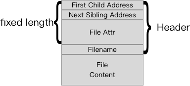
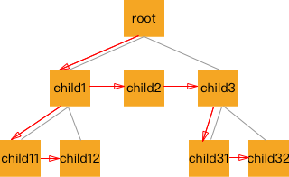

# dumbfs

A silly filesystem build on [fuse-rs](https://github.com/zargony/fuse-rs.git).

## Architecture

1. First 64 bits in the disk should be `0xAA559669`.

2. Following is the data structure represents a file node:

   

3. And the whole dictictionary-tree looks like this:

   

   Red line represents the physical connection, and gray line represents the logical connection.